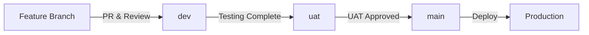

# BharatAtlas

> A comprehensive digital atlas platform for India

[](https://opensource.org/licenses/MIT)

## 📋 Table of Contents

- [About](#about)
- [Branch Strategy](#branch-strategy)
- [Getting Started](#getting-started)
- [Development Workflow](#development-workflow)
- [Deployment](#deployment)
- [Contributing](#contributing)
- [License](#license)

## 🌏 About

BharatAtlas is a digital atlas platform designed to provide comprehensive geographic, demographic, and cultural information about India. This project aims to create an accessible and interactive resource for exploring India's diverse regions, states, and territories.

## 🌿 Branch Strategy

This project follows a **three-tier branching strategy** to ensure code quality and stability across different environments:

### Branch Overview

| Branch | Purpose | Environment | Stability |
|--------|---------|-------------|-----------|
| `main` | Production-ready code | Production | 🟢 Stable |
| `uat` | User acceptance testing | UAT/Staging | 🟡 Testing |
| `dev` | Active development | Development | 🔴 Unstable |

### Branch Descriptions

#### 🚀 `main` - Production Branch
- **Purpose**: Contains only production-ready, thoroughly tested code
- **Deployment**: Automatically deployed to production environment
- **Protection**: Highly protected - requires code review and passing tests
- **Merge Source**: Only accepts merges from `uat` branch
- **Stability**: Maximum stability guaranteed

#### 🧪 `uat` - User Acceptance Testing Branch
- **Purpose**: Feature-complete code ready for stakeholder review and testing
- **Deployment**: Deployed to UAT/staging environment
- **Protection**: Protected - requires code review
- **Merge Source**: Accepts merges from `dev` branch
- **Stability**: High stability - features are complete but undergoing final validation

#### 🔧 `dev` - Development Branch
- **Purpose**: Active development and integration of new features
- **Deployment**: Deployed to development environment
- **Protection**: Minimal protection - allows rapid iteration
- **Merge Source**: Accepts merges from feature branches
- **Stability**: Lower stability - work in progress

### Merge Flow



**Standard Flow**: `feature branch` → `dev` → `uat` → `main` → `production`

### Branch Protection Rules

> [!IMPORTANT]
> The following protection rules should be configured in your Git hosting platform (GitHub, GitLab, etc.):

#### `main` Branch
- ✅ Require pull request reviews (minimum 2 approvals)
- ✅ Require status checks to pass
- ✅ Require branches to be up to date
- ✅ Require conversation resolution
- ✅ Do not allow force pushes
- ✅ Do not allow deletions

#### `uat` Branch
- ✅ Require pull request reviews (minimum 1 approval)
- ✅ Require status checks to pass
- ✅ Do not allow force pushes

#### `dev` Branch
- ✅ Require pull request reviews (optional)
- ✅ Allow force pushes (with caution)

## 🚀 Getting Started

### Prerequisites

> [!NOTE]
> Prerequisites will be updated as the project evolves. Check back regularly for updates.

```bash
# Example prerequisites (update as needed)
- Node.js >= 18.x
- npm >= 9.x
- Git >= 2.x
```

### Installation

1. **Clone the repository**
   ```bash
   git clone https://github.com/shorajtomer/BharatAtlas.git
   cd BharatAtlas
   ```

2. **Checkout the appropriate branch**
   ```bash
   # For development
   git checkout dev
   
   # For UAT testing
   git checkout uat
   
   # For production (read-only)
   git checkout main
   ```

3. **Install dependencies** (when applicable)
   ```bash
   npm install
   ```

4. **Set up environment variables** (when applicable)
   ```bash
   cp .env.example .env
   # Edit .env with your configuration
   ```

5. **Run the application** (when applicable)
   ```bash
   npm run dev
   ```

## 💻 Development Workflow

### Creating a New Feature

1. **Start from the `dev` branch**
   ```bash
   git checkout dev
   git pull origin dev
   ```

2. **Create a feature branch**
   ```bash
   git checkout -b feature/your-feature-name
   ```

3. **Make your changes**
   - Write clean, documented code
   - Follow the project's coding standards
   - Add tests for new functionality

4. **Commit your changes**
   ```bash
   git add .
   git commit -m "feat: add your feature description"
   ```

5. **Push to remote**
   ```bash
   git push origin feature/your-feature-name
   ```

6. **Create a Pull Request**
   - Target branch: `dev`
   - Provide a clear description
   - Link related issues
   - Request reviews

### Commit Message Convention

Follow [Conventional Commits](https://www.conventionalcommits.org/):

```
<type>(<scope>): <subject>

<body>

<footer>
```

**Types**:
- `feat`: New feature
- `fix`: Bug fix
- `docs`: Documentation changes
- `style`: Code style changes (formatting, etc.)
- `refactor`: Code refactoring
- `test`: Adding or updating tests
- `chore`: Maintenance tasks

**Example**:
```bash
git commit -m "feat(maps): add interactive state boundaries"
git commit -m "fix(api): resolve data loading issue for Kerala"
git commit -m "docs(readme): update installation instructions"
```

### Merging Strategy

#### From `feature` to `dev`
```bash
# After PR approval
git checkout dev
git pull origin dev
git merge --no-ff feature/your-feature-name
git push origin dev
```

#### From `dev` to `uat`
```bash
# When features are ready for UAT
git checkout uat
git pull origin uat
git merge --no-ff dev
git push origin uat
```

#### From `uat` to `main`
```bash
# After successful UAT
git checkout main
git pull origin main
git merge --no-ff uat
git push origin main
git tag -a v1.0.0 -m "Release version 1.0.0"
git push origin v1.0.0
```

## 🌐 Deployment

### Environments

| Environment | Branch | URL | Purpose |
|-------------|--------|-----|---------|
| Development | `dev` | TBD | Active development and testing |
| UAT/Staging | `uat` | TBD | User acceptance testing |
| Production | `main` | TBD | Live production environment |

> [!NOTE]
> Deployment URLs and CI/CD configurations will be added as the project infrastructure is set up.

## 🤝 Contributing

We welcome contributions! Please see our [CONTRIBUTING.md](CONTRIBUTING.md) for detailed guidelines.

### Quick Contribution Guide

1. Fork the repository
2. Create your feature branch from `dev`
3. Make your changes
4. Write or update tests
5. Ensure all tests pass
6. Submit a pull request to `dev`

### Code of Conduct

- Be respectful and inclusive
- Provide constructive feedback
- Focus on what is best for the community
- Show empathy towards others

## 📄 License

This project is licensed under the MIT License - see the [LICENSE](LICENSE) file for details.

Copyright (c) 2025 Shoraj Tomer

---

## 📞 Contact & Support

- **Author**: Shoraj Tomer
- **GitHub**: [@shorajtomer](https://github.com/shorajtomer)

---

<div align="center">
Made with ❤️ for India
</div>
