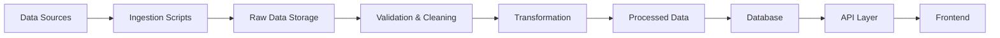

# Data Sources for BharatAtlas

## 🏛️ Government & Official Sources

### 1. **Census of India**
- **URL**: https://censusindia.gov.in/
- **Data Type**: Demographics, population, literacy, housing
- **Coverage**: National, State, District, Sub-district
- **Update Frequency**: Decennial (every 10 years)
- **Format**: PDF, Excel, API (limited)
- **License**: Open Government Data
- **Priority**: ⭐⭐⭐⭐⭐

**Key Datasets**:
- Population by age, gender, religion
- Literacy rates
- Household characteristics
- Economic activity
- Migration patterns

### 2. **Survey of India**
- **URL**: https://surveyofindia.gov.in/
- **Data Type**: Topographic maps, geodetic data, boundaries
- **Coverage**: National
- **Update Frequency**: Continuous
- **Format**: Shapefile, GeoJSON, Raster
- **License**: Restricted (permissions required)
- **Priority**: ⭐⭐⭐⭐⭐

**Key Datasets**:
- State and district boundaries
- Topographic maps
- Elevation data
- Control points

### 3. **National Informatics Centre (NIC)**
- **URL**: https://www.nic.in/
- **Data Type**: Government data portal, digital services
- **Coverage**: National, State
- **Update Frequency**: Varies
- **Format**: API, JSON, XML
- **License**: Open Government Data
- **Priority**: ⭐⭐⭐⭐

### 4. **India Meteorological Department (IMD)**
- **URL**: https://mausam.imd.gov.in/
- **Data Type**: Weather, climate, rainfall
- **Coverage**: National, Regional
- **Update Frequency**: Real-time, Daily, Monthly
- **Format**: API, CSV, PDF
- **License**: Open with attribution
- **Priority**: ⭐⭐⭐⭐

### 5. **Ministry of Statistics and Programme Implementation (MoSPI)**
- **URL**: https://mospi.gov.in/
- **Data Type**: Economic indicators, statistical data
- **Coverage**: National, State
- **Update Frequency**: Monthly, Quarterly, Annual
- **Format**: Excel, PDF
- **License**: Open Government Data
- **Priority**: ⭐⭐⭐⭐

### 6. **Geological Survey of India (GSI)**
- **URL**: https://www.gsi.gov.in/
- **Data Type**: Geological maps, mineral resources
- **Coverage**: National
- **Update Frequency**: Periodic
- **Format**: PDF, Shapefile
- **License**: Restricted
- **Priority**: ⭐⭐⭐

### 7. **National Remote Sensing Centre (NRSC)**
- **URL**: https://www.nrsc.gov.in/
- **Data Type**: Satellite imagery, land use/land cover
- **Coverage**: National
- **Update Frequency**: Periodic
- **Format**: GeoTIFF, Shapefile
- **License**: Varies by dataset
- **Priority**: ⭐⭐⭐⭐

### 8. **Archaeological Survey of India (ASI)**
- **URL**: https://asi.nic.in/
- **Data Type**: Heritage sites, monuments
- **Coverage**: National
- **Update Frequency**: Annual
- **Format**: PDF, Database
- **License**: Open with attribution
- **Priority**: ⭐⭐⭐

## 🌍 International & Open Data Sources

### 9. **OpenStreetMap (OSM)**
- **URL**: https://www.openstreetmap.org/
- **Data Type**: Roads, buildings, POIs, boundaries
- **Coverage**: Global (India well-mapped)
- **Update Frequency**: Real-time (community-driven)
- **Format**: OSM XML, PBF, GeoJSON
- **License**: ODbL (Open Database License)
- **Priority**: ⭐⭐⭐⭐⭐

**Key Features**:
- Road networks
- Building footprints
- Points of interest
- Administrative boundaries
- Land use

### 10. **Natural Earth**
- **URL**: https://www.naturalearthdata.com/
- **Data Type**: Physical and cultural vector data
- **Coverage**: Global
- **Update Frequency**: Periodic
- **Format**: Shapefile, GeoJSON
- **License**: Public Domain
- **Priority**: ⭐⭐⭐

### 11. **World Bank Open Data**
- **URL**: https://data.worldbank.org/
- **Data Type**: Economic, social, development indicators
- **Coverage**: Global (India included)
- **Update Frequency**: Annual
- **Format**: API, CSV, Excel
- **License**: CC BY 4.0
- **Priority**: ⭐⭐⭐

### 12. **United Nations Data**
- **URL**: https://data.un.org/
- **Data Type**: SDG indicators, demographic data
- **Coverage**: Global
- **Update Frequency**: Varies
- **Format**: API, CSV
- **License**: Open
- **Priority**: ⭐⭐

## 🗺️ Geospatial Data Providers

### 13. **Mapbox**
- **URL**: https://www.mapbox.com/
- **Data Type**: Base maps, satellite imagery, geocoding
- **Coverage**: Global
- **Update Frequency**: Continuous
- **Format**: Vector tiles, Raster tiles, API
- **License**: Commercial (free tier available)
- **Priority**: ⭐⭐⭐⭐

### 14. **Google Maps Platform**
- **URL**: https://developers.google.com/maps
- **Data Type**: Maps, geocoding, places, directions
- **Coverage**: Global
- **Update Frequency**: Continuous
- **Format**: API
- **License**: Commercial
- **Priority**: ⭐⭐⭐

### 15. **GADM (Database of Global Administrative Areas)**
- **URL**: https://gadm.org/
- **Data Type**: Administrative boundaries
- **Coverage**: Global (India included)
- **Update Frequency**: Periodic
- **Format**: Shapefile, GeoJSON, KML
- **License**: Free for non-commercial use
- **Priority**: ⭐⭐⭐⭐

## 📊 Commercial & Research Sources

### 16. **DataMeet Community**
- **URL**: https://datameet.org/
- **Data Type**: Curated India datasets, boundaries
- **Coverage**: National, State, District
- **Update Frequency**: Community-driven
- **Format**: GeoJSON, Shapefile, CSV
- **License**: Open (varies by dataset)
- **Priority**: ⭐⭐⭐⭐⭐

### 17. **India Data Portal**
- **URL**: https://data.gov.in/
- **Data Type**: Government datasets across sectors
- **Coverage**: National, State
- **Update Frequency**: Varies
- **Format**: CSV, Excel, API
- **License**: Open Government Data
- **Priority**: ⭐⭐⭐⭐⭐

### 18. **Reserve Bank of India (RBI)**
- **URL**: https://www.rbi.org.in/
- **Data Type**: Economic, financial, banking data
- **Coverage**: National, State
- **Update Frequency**: Daily, Monthly, Quarterly
- **Format**: Excel, PDF, API
- **License**: Open with attribution
- **Priority**: ⭐⭐⭐

## 🎯 Data Integration Strategy

### Phase 1: Foundation (Months 1-3)
1. **Administrative Boundaries**
   - Survey of India (official)
   - DataMeet (community-verified)
   - GADM (backup/validation)

2. **Base Map Data**
   - OpenStreetMap (primary)
   - Mapbox (rendering)
   - Natural Earth (context)

3. **Basic Demographics**
   - Census of India (2011, 2021)
   - India Data Portal

### Phase 2: Enrichment (Months 4-6)
1. **Economic Data**
   - MoSPI
   - RBI
   - World Bank

2. **Infrastructure**
   - OpenStreetMap
   - Government portals
   - NIC databases

3. **Cultural & Heritage**
   - ASI
   - UNESCO
   - State tourism departments

### Phase 3: Intelligence (Months 7-12)
1. **Real-time Data**
   - IMD (weather)
   - Traffic APIs
   - Social media signals

2. **Satellite & Remote Sensing**
   - NRSC
   - Sentinel Hub
   - Landsat

3. **Specialized Datasets**
   - Agricultural data
   - Industrial zones
   - Educational institutions

## 🔄 Data Update Workflow

### Automated Updates
- **Daily**: Weather, traffic, news
- **Weekly**: Economic indicators, market data
- **Monthly**: Statistical releases, government reports
- **Quarterly**: Census estimates, economic surveys
- **Annual**: Major datasets, boundary updates

### Manual Curation
- Heritage site verification
- Community contributions
- Data quality checks
- Source validation

## ⚖️ Licensing & Attribution

### Open Data
- Clear attribution to source
- License compliance (ODbL, CC BY, etc.)
- Redistribution terms respected

### Restricted Data
- Proper permissions obtained
- Usage limitations documented
- No unauthorized redistribution

### Commercial Data
- API key management
- Usage quota monitoring
- Cost optimization

## 🛠️ Data Processing Pipeline

### Tools & Technologies
- **Ingestion**: Python (requests, BeautifulSoup)
- **Processing**: Pandas, GeoPandas
- **Validation**: Great Expectations
- **Storage**: PostgreSQL + PostGIS
- **Caching**: Redis
- **API**: Express.js / FastAPI

## 📋 Data Quality Standards

### Accuracy
- ✅ Source verification
- ✅ Cross-reference validation
- ✅ Community feedback loop

### Completeness
- ✅ Coverage metrics
- ✅ Gap identification
- ✅ Prioritized filling

### Timeliness
- ✅ Update frequency tracking
- ✅ Staleness alerts
- ✅ Version control

### Consistency
- ✅ Format standardization
- ✅ Unit normalization
- ✅ Schema validation

## 🚨 Data Governance

### Privacy
- No personal identifiable information (PII)
- Aggregated data only
- GDPR/Data Protection Act compliance

### Security
- Encrypted data transmission
- Access control
- Audit logging

### Ethics
- Responsible data use
- No discriminatory applications
- Transparent methodology

---

**Last Updated**: December 28, 2025  
**Maintained By**: BharatAtlas Data Team  
**Review Frequency**: Quarterly
