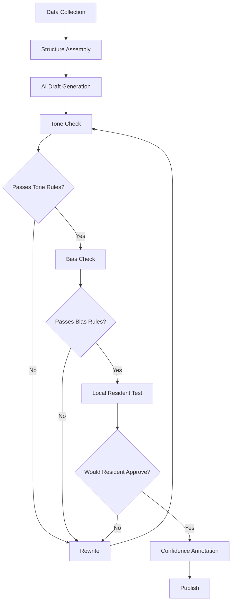

# The Place Narrative Engine

## Core Purpose

The Place Narrative Engine ensures that every place in India is described **accurately, respectfully, clearly, and without distortion**—regardless of its size, wealth, or visibility.

**The narrative must:**
- Inform without persuading
- Explain without simplifying away truth
- Respect without romanticizing
- Highlight gaps without shaming

> **BharatAtlas does not tell stories. It explains realities.**

## The Non-Negotiable Tone

Every description must be:

- ✅ **Neutral** — no praise, no blame
- ✅ **Grounded** — rooted in verifiable context
- ✅ **Plain-spoken** — understandable by a 16-year-old
- ✅ **Respectful** — especially for underdeveloped or marginalized places
- ✅ **Calm** — no urgency, hype, or alarmism

**If a sentence sounds like:**
- Journalism → ❌
- Marketing → ❌
- Activism → ❌

**It does not belong in BharatAtlas.**

## What AI Is Allowed vs. Forbidden to Infer

### AI MAY Infer:

✅ **Structural patterns**
- "A large share of the population depends on agriculture."

✅ **Broad economic gaps**
- "Limited healthcare facilities may affect access."

✅ **Comparative context**
- "Literacy rates are lower than the district average."

### AI MUST NEVER Infer:

❌ Political motivations or outcomes  
❌ Cultural value judgments  
❌ Moral assessments  
❌ Individual or group behavior  
❌ Future success or failure  

**If inference crosses into intent, blame, or prediction, it is forbidden.**

## Writing About Underdeveloped or Sensitive Regions

### Mandatory Rules:

1. **Never use:** backward, poor, undeveloped, neglected
2. **Describe conditions, not judgments**
3. **Focus on constraints, not failures**
4. **Avoid emotional language**

### Examples:

✅ **Correct:**
> "Access to secondary healthcare facilities is limited, requiring residents to travel to nearby towns."

❌ **Incorrect:**
> "The village lacks basic healthcare and remains underdeveloped."

## Strict Narrative Structure

Every place description must follow this exact structure, even if sections are short.

### 1. Place Overview
**Intent:** Establish what this place is and why it exists.

- Administrative identity
- Role in local context
- One paragraph maximum

**Example:**
> Yelahanka is a town in Bangalore North tehsil, Bangalore Urban district, Karnataka. It serves as a residential and commercial hub on the northern edge of Bangalore city.

### 2. Geography & Environment
**Intent:** Explain physical constraints and advantages.

- Terrain
- Climate
- Natural features
- Environmental factors affecting life or economy

**Example:**
> The area is characterized by relatively flat terrain with an elevation of approximately 920 meters. The climate is tropical savanna with distinct wet and dry seasons. Several lakes historically supported agriculture, though urbanization has reduced their extent.

### 3. People & Demographics
**Intent:** Describe who lives here, without labeling.

- Population size (if known)
- Age distribution
- Occupation patterns
- Languages

**Example:**
> The 2021 census recorded a population of approximately 85,000. Kannada is the primary language, with significant Tamil and Telugu-speaking populations. The working-age population is engaged in a mix of services, manufacturing, and agriculture.

### 4. Economy & Livelihood
**Intent:** Explain how people sustain themselves.

- Main activities
- Crops / industries
- Market access
- Employment nature

**Example:**
> Economic activity centers on small-scale manufacturing, retail trade, and services supporting the adjacent urban area. Agricultural land has decreased over the past two decades due to residential expansion. Proximity to Bangalore provides employment opportunities in technology and services sectors.

### 5. Culture & Everyday Life
**Intent:** Capture lived experience without folklore.

- Food habits
- Festivals
- Crafts
- Daily routines (only if verifiable)

**Example:**
> Daily life reflects a blend of traditional and urban patterns. Rice and ragi remain dietary staples. Major festivals include Ugadi, Dasara, and Deepavali, observed across communities. Weekly markets continue to operate alongside modern retail.

### 6. Governance & Facilities
**Intent:** Show how the place is administered and supported.

- Local governance structure
- Education
- Healthcare
- Connectivity

**Example:**
> Yelahanka is administered by the Bruhat Bengaluru Mahanagara Palike (BBMP). The area has 15 government primary schools and 8 secondary schools. Healthcare is provided through 2 primary health centers and several private clinics. Road connectivity to central Bangalore is available via National Highway 44.

### 7. AI-Inferred Insights (Explicitly Marked)
**Intent:** Provide interpretation, not prediction.

- Strengths
- Constraints
- Development gaps

**This section must be visually and textually separated.**

**Example:**
> **AI-Generated Insights** (Confidence: 0.75, Generated: 2025-01-15)
>
> **Strengths:**
> - Proximity to major employment centers
> - Established road and rail connectivity
> - Diverse economic base
>
> **Constraints:**
> - Water supply infrastructure under pressure from population growth
> - Traffic congestion during peak hours
> - Limited public healthcare capacity relative to population
>
> **Development Gaps:**
> - Public transportation coverage could be expanded
> - Wastewater treatment capacity may require upgrading
> - Green space per capita is below urban planning standards

### 8. Data Confidence
**Intent:** Build trust.

- What is verified
- What is estimated
- What is inferred
- What is unknown

**Example:**
> **Data Confidence:**
> - Population (2021): Verified (Census 2021)
> - Number of schools: Verified (UDISE+ 2024)
> - Healthcare facilities: Estimated (OSM + ground surveys)
> - Economic composition: Inferred (district-level data + employment patterns)
> - Water infrastructure capacity: Unknown (municipal data not publicly available)

## Rules for Avoiding Stereotypes & Bias

1. **Never attribute behavior to culture**
   - ❌ "People here are traditional and resist change"
   - ✅ "Agricultural practices have remained consistent over decades"

2. **Never generalize communities**
   - ❌ "Muslims in this area are traders"
   - ✅ "Trade and commerce are significant economic activities"

3. **Never compare places in a way that implies superiority**
   - ❌ "Unlike backward villages, this town has electricity"
   - ✅ "Electrification reached this town in 1985"

4. **Never imply causation without evidence**
   - ❌ "Low literacy causes poverty here"
   - ✅ "Literacy rates are 58%, below the district average of 72%"

**Comparison is allowed only with data.**

## Local Resident Test (Mandatory)

Before publishing, every narrative must pass this mental check:

> **"If a long-time resident reads this, will they say: 'This is fair and accurate,' even if it highlights problems?"**

**If not → rewrite.**

## Narrative Generation Workflow



## AI Prompt Template for Narrative Generation

```
Generate a place description for {PLACE_NAME}, {STATE_NAME} following these strict rules:

TONE REQUIREMENTS:
- Neutral (no praise, no blame)
- Plain-spoken (16-year-old comprehension)
- Respectful (especially for marginalized places)
- Calm (no urgency or hype)

FORBIDDEN WORDS:
backward, poor, undeveloped, neglected, struggling, suffering, unfortunate

FORBIDDEN INFERENCES:
- Political motivations
- Cultural value judgments
- Moral assessments
- Future predictions
- Behavioral attributions

REQUIRED STRUCTURE:
1. Place Overview (1 paragraph)
2. Geography & Environment
3. People & Demographics
4. Economy & Livelihood
5. Culture & Everyday Life
6. Governance & Facilities
7. AI-Inferred Insights (clearly marked)
8. Data Confidence

DATA AVAILABLE:
{STRUCTURED_DATA_JSON}

CONFIDENCE LEVELS:
{CONFIDENCE_SCORES}

Generate the narrative. Mark all inferences explicitly. If data is missing, state "Data not available" rather than inventing details.
```

## Quality Assurance Checklist

Before publishing any narrative, verify:

- [ ] No forbidden words used
- [ ] No emotional language
- [ ] All inferences marked as AI-generated
- [ ] Confidence scores provided
- [ ] No cultural stereotypes
- [ ] No political implications
- [ ] No predictions about future
- [ ] Passes local resident test
- [ ] All 8 sections present (even if brief)
- [ ] Data sources cited

## Why This Engine Matters

**Without this engine:**
- BharatAtlas becomes Wikipedia (crowdsourced, inconsistent)
- Or worse, a judgment machine (biased, harmful)

**With this engine:**
- BharatAtlas becomes trusted infrastructure
- Usable by policymakers, entrepreneurs, students
- Defensible against accusations of bias
- Scalable to 600,000+ villages

## Non-Negotiable Final Rule

> **If a narrative creates emotion before understanding, it is wrong.**

---

**Last Updated**: December 28, 2025  
**Document Owner**: Content & AI Architecture  
**Status**: Foundational - Mandatory for all narrative generation
