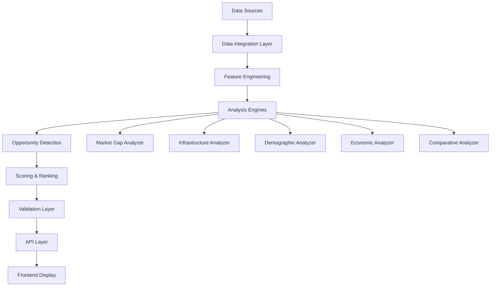

# Opportunity Engine

## 🎯 Overview

The Opportunity Engine is BharatAtlas's AI-powered intelligence layer that analyzes multi-dimensional data to identify business opportunities, development gaps, and investment potential across India.

## 🧠 Core Concept

By combining demographic, economic, infrastructure, and cultural data, the Opportunity Engine detects patterns and gaps that represent actionable opportunities for:

- **Entrepreneurs**: Underserved markets and business ideas
- **Investors**: High-potential sectors and regions
- **Policymakers**: Development priorities and resource allocation
- **Researchers**: Trend analysis and comparative insights

## 🔍 Detection Algorithms

### 1. Market Gap Analysis

**Algorithm**: Supply-Demand Mismatch Detection

**Inputs**:
- Population demographics (age, income, education)
- Existing business density by category
- Benchmark data from similar regions
- Consumer behavior patterns

**Process**:
```
1. Calculate expected service density based on population
2. Compare actual vs expected for each category
3. Identify significant gaps (>30% deviation)
4. Rank by market size and accessibility
5. Filter by feasibility criteria
```

**Output**: Ranked list of underserved market categories

**Example**:
```json
{
  "location": "Raipur, Chhattisgarh",
  "opportunity": "Premium Coffee Shops",
  "gap_score": 0.78,
  "market_size": "₹2-3 Cr annually",
  "rationale": "Population of 500K+ with 25% young professionals, but only 2 premium cafes vs expected 8-10",
  "confidence": "High"
}
```

### 2. Infrastructure Gap Detection

**Algorithm**: Comparative Infrastructure Analysis

**Inputs**:
- Road density, connectivity scores
- Healthcare facility ratios
- Educational institution coverage
- Digital infrastructure metrics
- Benchmark standards

**Process**:
```
1. Calculate infrastructure indices per capita
2. Compare against national/state averages
3. Identify critical gaps (below 70% of benchmark)
4. Prioritize by population impact
5. Estimate investment requirements
```

**Output**: Prioritized infrastructure development needs

### 3. Demographic Opportunity Mapping

**Algorithm**: Population Trend Analysis

**Inputs**:
- Age distribution and projections
- Migration patterns
- Education levels
- Employment rates

**Process**:
```
1. Identify demographic shifts (youth bulge, aging, migration)
2. Map demographic needs to service categories
3. Project demand over 5-10 years
4. Identify early-mover opportunities
5. Calculate market timing scores
```

**Output**: Demographic-driven opportunity timeline

### 4. Economic Cluster Detection

**Algorithm**: Industry Concentration Analysis

**Inputs**:
- Industry distribution
- Employment by sector
- Supply chain presence
- Skill availability

**Process**:
```
1. Identify existing industry clusters
2. Detect missing supply chain components
3. Find complementary business opportunities
4. Assess ecosystem maturity
5. Recommend cluster expansion strategies
```

**Output**: Cluster-based business opportunities

### 5. Comparative Advantage Analysis

**Algorithm**: Regional Strength Identification

**Inputs**:
- Natural resources
- Geographic location
- Cultural assets
- Existing industries
- Skill base

**Process**:
```
1. Map unique regional attributes
2. Identify underutilized assets
3. Find successful models in similar regions
4. Calculate competitive advantage scores
5. Recommend leverage strategies
```

**Output**: Region-specific competitive advantages

## 📊 Scoring Framework

### Opportunity Score Calculation

Each opportunity is scored on multiple dimensions:

```
Opportunity Score = (
  Market_Size × 0.25 +
  Growth_Potential × 0.20 +
  Feasibility × 0.20 +
  Competition_Level × 0.15 +
  Infrastructure_Readiness × 0.10 +
  Regulatory_Environment × 0.10
) × Confidence_Factor
```

**Thresholds**:
- **High Potential**: Score > 75
- **Medium Potential**: Score 50-75
- **Low Potential**: Score < 50

### Confidence Levels

- **High (>80%)**: Multiple verified data sources, clear patterns
- **Medium (50-80%)**: Some data gaps, reasonable inference
- **Low (<50%)**: Limited data, speculative analysis

## 🎨 Opportunity Categories

### Business Opportunities
1. **Retail & Services**
   - Underserved product categories
   - Service gaps (healthcare, education, entertainment)
   - Franchise opportunities

2. **Manufacturing & Industry**
   - Supply chain gaps
   - Raw material proximity advantages
   - Skill-based manufacturing

3. **Technology & Innovation**
   - Digital service gaps
   - Tech adoption opportunities
   - Smart solutions for local problems

4. **Agriculture & Food**
   - Value addition opportunities
   - Agri-tech applications
   - Food processing potential

### Development Opportunities
1. **Infrastructure**
   - Transportation gaps
   - Utility coverage
   - Public facilities

2. **Social Services**
   - Healthcare access
   - Education quality
   - Skill development

3. **Environmental**
   - Renewable energy potential
   - Waste management
   - Water conservation

### Investment Opportunities
1. **Real Estate**
   - Growth corridors
   - Commercial development
   - Affordable housing

2. **Public-Private Partnerships**
   - Infrastructure projects
   - Service delivery
   - Technology implementation

## 🔧 Implementation Architecture



### Technology Stack

**Data Processing**:
- Python (Pandas, NumPy, GeoPandas)
- Apache Spark (for large-scale processing)

**Machine Learning**:
- Scikit-learn (clustering, regression)
- TensorFlow/PyTorch (deep learning models)
- Prophet (time-series forecasting)

**Analysis**:
- Statistical analysis (SciPy, StatsModels)
- Geospatial analysis (PostGIS, Shapely)
- Network analysis (NetworkX)

**Storage**:
- PostgreSQL (structured data)
- MongoDB (unstructured insights)
- Redis (caching)

## 📈 Use Cases

### Use Case 1: Entrepreneur Market Research

**Scenario**: Small business owner wants to open a new venture

**Input**: Location, business category, investment capacity

**Process**:
1. Analyze market gaps in the location
2. Assess competition and demand
3. Estimate market size and growth
4. Identify optimal business model
5. Provide location-specific recommendations

**Output**: Customized business opportunity report

### Use Case 2: Government Development Planning

**Scenario**: District administration planning infrastructure projects

**Input**: District, budget, development priorities

**Process**:
1. Identify critical infrastructure gaps
2. Prioritize by population impact
3. Estimate costs and timelines
4. Suggest funding sources
5. Provide implementation roadmap

**Output**: Prioritized development plan

### Use Case 3: Investor Due Diligence

**Scenario**: Investor evaluating regional opportunities

**Input**: Region, sector, investment horizon

**Process**:
1. Analyze economic trends and growth drivers
2. Identify high-potential sectors
3. Assess risks and challenges
4. Compare with alternative locations
5. Project ROI scenarios

**Output**: Investment thesis and recommendations

## 🎯 Roadmap

### Phase 1: Foundation (Months 1-3)
- ✅ Define opportunity categories
- ✅ Design scoring framework
- 🔄 Implement basic gap analysis
- 🔄 Create API endpoints

### Phase 2: Intelligence (Months 4-6)
- 📋 ML model development
- 📋 Predictive analytics
- 📋 Trend detection
- 📋 Confidence scoring

### Phase 3: Refinement (Months 7-9)
- 📋 User feedback integration
- 📋 Accuracy improvements
- 📋 Real-time updates
- 📋 Personalization

### Phase 4: Scale (Months 10-12)
- 📋 Village-level analysis
- 📋 Sector-specific engines
- 📋 API marketplace
- 📋 Enterprise features

## 🔬 Validation & Quality

### Validation Methods
1. **Historical Validation**: Test predictions against known outcomes
2. **Expert Review**: Domain expert validation
3. **User Feedback**: Real-world validation from users
4. **A/B Testing**: Compare algorithm variations

### Quality Metrics
- **Accuracy**: % of opportunities that prove viable
- **Coverage**: % of actual opportunities detected
- **Relevance**: User engagement with recommendations
- **Timeliness**: Freshness of insights

### Continuous Improvement
- Monthly model retraining
- Quarterly algorithm updates
- User feedback loop
- Performance monitoring

## ⚖️ Ethical Considerations

### Bias Mitigation
- Diverse training data
- Regular bias audits
- Transparent methodology
- Community feedback

### Responsible Use
- No discriminatory applications
- Privacy protection
- Clear limitations disclosure
- Human oversight

### Transparency
- Explainable AI
- Data source attribution
- Confidence levels
- Methodology documentation

---

**Last Updated**: December 28, 2025  
**Status**: Design Phase  
**Next Review**: January 2026
